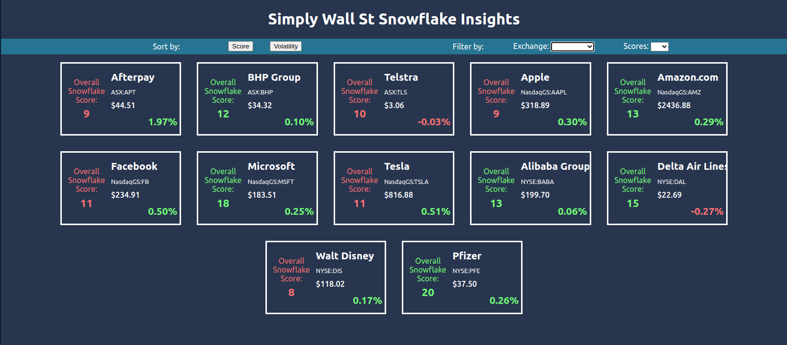
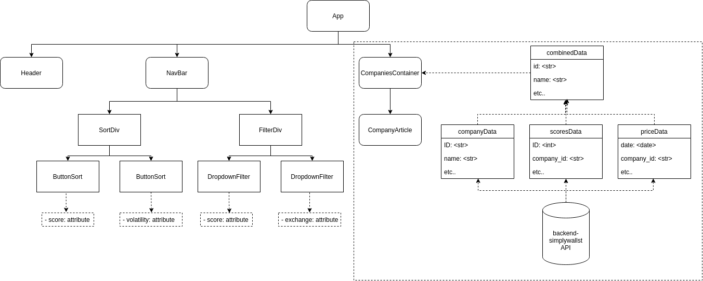

# Front End Web App - Simply Wall St Coding Challenge

## Created by Raymond Doan, *aspiring* Junior Front-end Developer at Simply Wall St

## Introduction

With more financial information provided in the market, users are looking for ways to be provided quick insights and information on suitable companies to invest into. SWS Snowflake Insights is a comparison tool, comparing the volatility and overall scores of each company based on dividends, future performance, health, management analysis, past performance and value. The data used and shown in the application is fetched from an API backend solution ([link here](https://github.com/raymonddoan/backend-simplywallst)), which is making requests from a SQLite database provided by Simply Wall St. 

## Features

- Super easy to setup
- Mobile responsive design
- High contrast between company scores
- High contrast between company volatility

## Instructions

To install and use the web application:

1. Clone the app using terminal: `git clone git@github.com:raymonddoan/frontend-simplywallst.git`.
2. Once the app has been cloned, change into the app's directory using: `cd frontend-simplywallst`.
3. Install the dependencies required to run the app using: `yarn install`.
4. Once the dependencies have been installed, make sure the back-end server is running. Follow the instructions outlined ([here](https://github.com/raymonddoan/backend-simplywallst)).
5. Once the back-end server is running, you can now start the app using: `yarn start`.
6. To run the tests, use: `yarn test`.

## Architectural Elements and Decisions

### Tech Stack

The web application was built on:

- `react` as the front-end framework,
- `styled-components` for styling the components,
- `axios` for fetching from the API solution and;
- `jest` for the test code and modules. 

### Application Design

With the complexity of developing a back-end API solution, Figure 1 shows how I designed the web application and its data models. The reason for the particular design was to store all the required data of the companies in a container with each company being stored in its own `companyArticle`. The `companiesContainer` was the parent component consisting of `companyArticle` components representing each company.

> Figure 1. UML diagram of the front-end web application.

### Design and Styling

I chose the `styled-components` library to style the components for its customisation and interoperability with other languages like ReactNative and Vue.js.

`styled-components` gave me the freedom to create custom React components with CSS, which would be reusable through out the entire project. I chose the library because I was familiar with the plain CSS, which is largely known by UX/UI designers who may work on the project in the future. Also, if the web application was redesigned in another language like Vue.js or as a mobile application using React Native, I used `styled-components` for consistency across different platforms. 

Light green and red colours were used to highlight the differences in prices between the competitors. To contrast the dark background colours, I wanted to make it obvious to the user which companies were higher performing options, highlighting those in green.

### Maintainability and Reusability

Multiple components and utilities were created to make the web application is less resource intensive and assist with code maintainability and reusability. These included: 

- For each endpoint, a single API request `importData` with a string argument to the endpoint was created and called to retrieve the data.
- For each drop-down filter, a single component `<DropdownFilter>` was created with unique states being passed through the standard props.
- Similar to the drop-down filter, the buttons for sorting the data based on `score` or `volatility` were derived from the single component.

## Trade-offs

As an MVP design, there were a number of trade-offs made in the design of the project. These included:

- When combining the data from the two API requests, the code required to combine the data reaches a time complexity of `O(n^2)`. I am aware this may run into scalability issues with larger data sets and I would aim to  refactor the code base to use a hash table to hold the `companyData` and compare the ID's in the `scoreData` to retrieve the `total` score, reducing the time complexity to `O(n)`.
- For an MVP design, I was unable to finish the tests on fetching from the API endpoints. If more time was available, I would have worked on completing these tests.

## Assumptions made

In the design of the application, I assumed the pricing data provided reflected change in prices for the last 90 days and no pagination was factored into its design. Only the twelve companies being reflected in this application was another assumption made. 

## Learnings

This coding challenge was a great learning experience with having generating clean code, code accessibility and readable documentation. I was challenged into building sort and filter functionalities, based on more than one parameters, and understanding about the best practices of testing, especially with testing API requests, which I found was vital knowledge for future projects.

